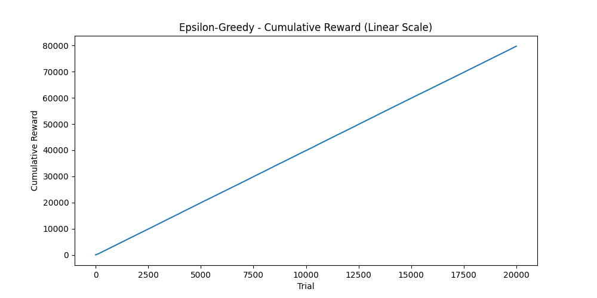
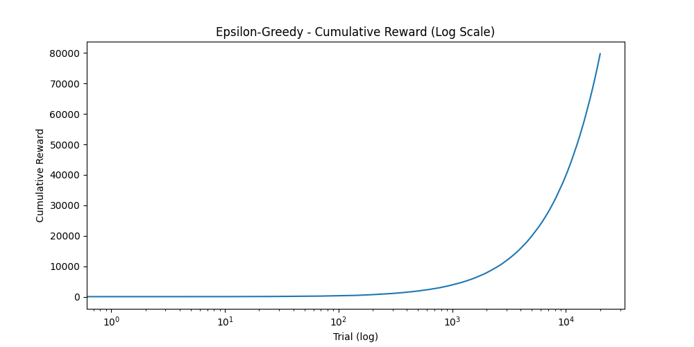
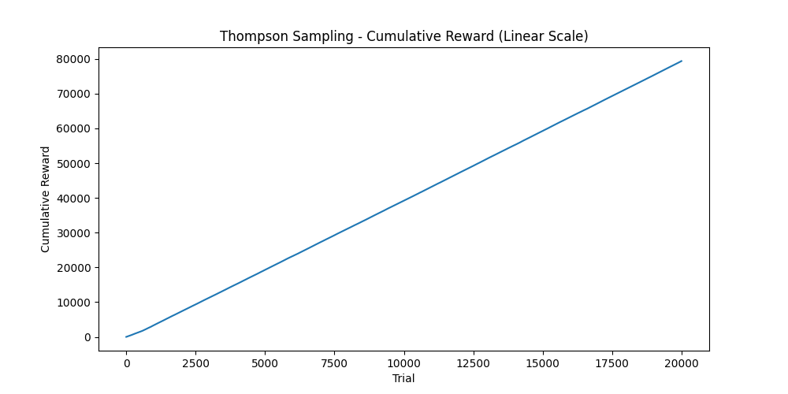
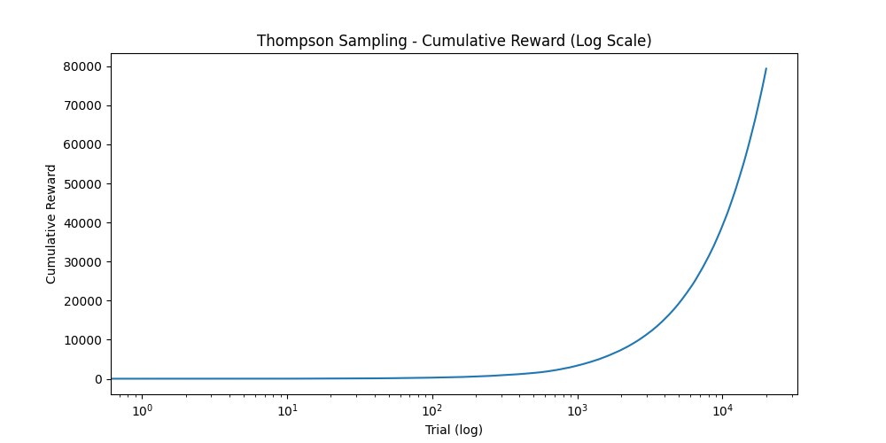
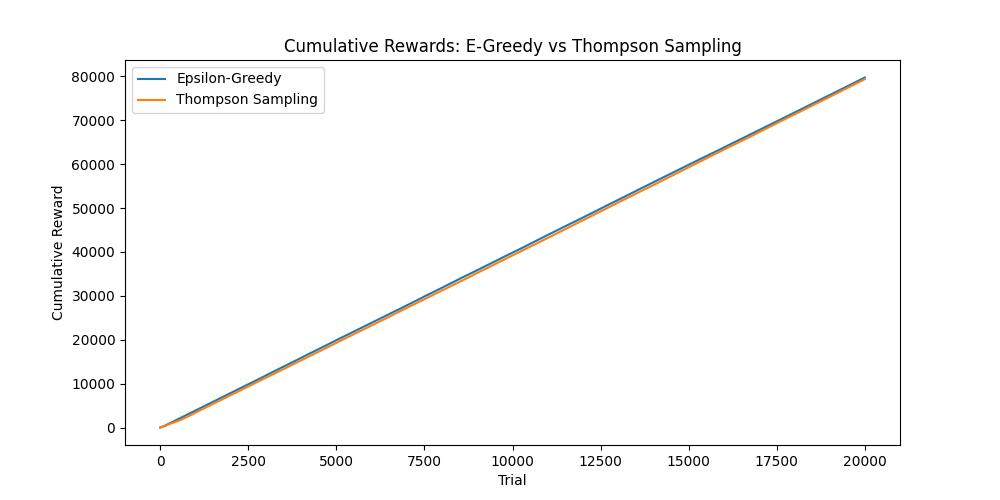
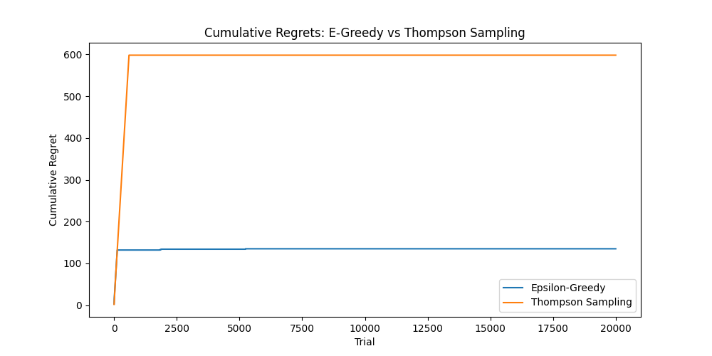

# Homework 2: A/B Testing with Multi-Armed Bandits

## Overview
This project implements two multi-armed bandit algorithms to simulate an A/B testing scenario with four advertisement options.
Each bandit has a different true mean reward. The goal is to find the best bandit (highest reward) as efficiently as possible.

- **Bandit Rewards:** [1, 2, 3, 4]
- **Number of Trials:** 20,000
- **Random Seed:** 42 (for reproducibility)

---

## Algorithms

### Epsilon-Greedy
At each trial, the agent either:
- **Explores** (tries a random arm) with probability ε = 1/t
- **Exploits** (picks the best known arm) with probability 1 - ε

As trials increase, epsilon shrinks, so the agent explores less and exploits more over time.

### Thompson Sampling
At each trial, the agent:
- Maintains a **Gaussian posterior distribution** over each arm's true mean reward
- **Samples** one value from each arm's posterior
- Pulls the arm with the **highest sample**
- Updates the posterior based on the observed reward

This approach naturally balances exploration and exploitation through uncertainty — arms that haven't been tried much have wider distributions and are more likely to be sampled.

---

## Results

| Algorithm | Cumulative Reward | Cumulative Regret |
|---|---|---|
| Epsilon-Greedy | 79,734.47 | 265.53 |
| Thompson Sampling | 79,369.13 | 630.87 |

Both algorithms successfully identify **Bandit 4** (true mean = 4) as the best arm.

> Note: results are reproducible with `np.random.seed(42)`.

---

## Visualizations

### Epsilon-Greedy — Learning Process



### Thompson Sampling — Learning Process



### Comparison



---

## Project Structure

```
Homework_2/
├── Bandit.py          # Main implementation
├── requirements.txt   # Dependencies
├── results.csv        # Output: Bandit, Reward, Algorithm
├── README.md          # This file
└── *.png              # Output plots
```

---

## How to Run

1. Install dependencies:
```bash
pip install -r requirements.txt
```

2. Run the experiment:
```bash
python Bandit.py
```

This will generate the plots and `results.csv` automatically.

---

## Dependencies
- `loguru` — logging
- `numpy` — numerical computations
- `matplotlib` — visualizations
- `pandas` — data handling
